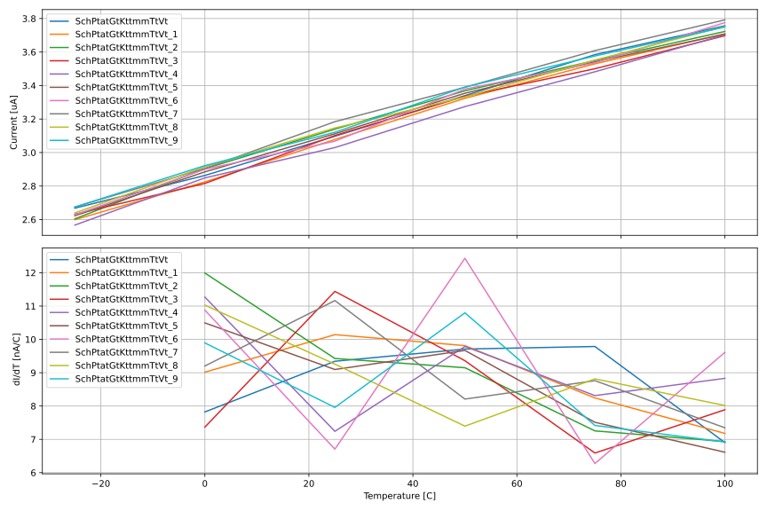
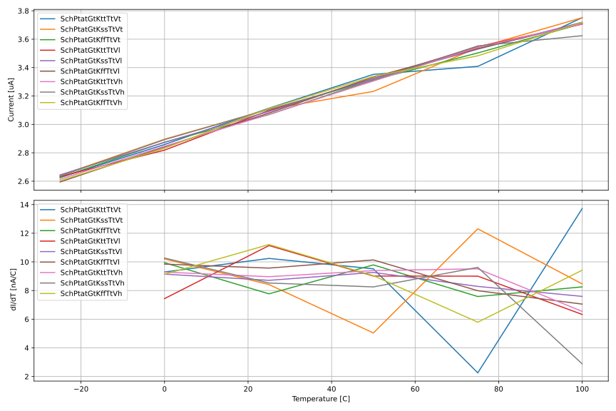
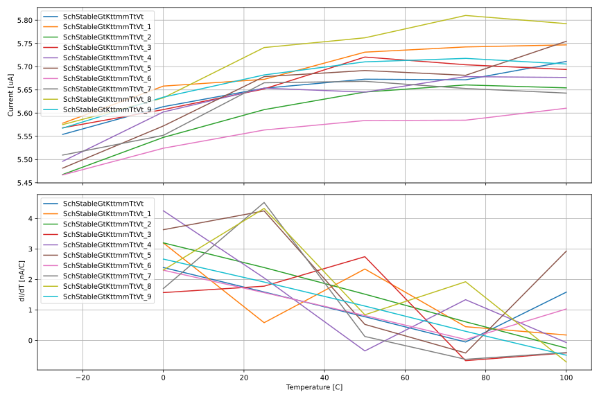
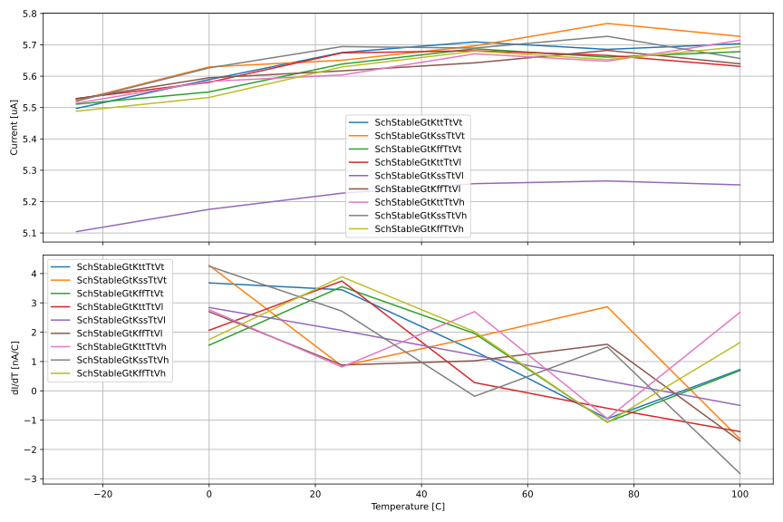

# JNW_GR00_SKY130A

# Who
Carsten Wulff

# Why
Is it possible to make a accurate temperature sensor based on a switched
capacitor bandgap reference? I don't know, let's find out 

# How
 
Grand Plan:

- [x] Make a discrete time PTAT current source work (ideal comparator)
- [x] Add comparator, with auto-zero
- [x] Add constant current output to the design 
- [ ] Add constant voltage output (VREF) to the design 
- [ ] Add a PTAT charging of a capacitor to VREF to convert from current to time 
- [ ] Add a constant current charging to eliminate C variation?

# What

For schematics, see [documents/schematics](documents/schematics.md) 

- [rtl/bgCore.sv](rtl/bgCore.sv): Analog top level (although written in verilog)
  - design/JNW\_GR00\_SKY130NM/JNWG00\_BDAC: Bipolars and resistors for discrete
    time Bandba reference
  - design/JNW\_GR00\_SKY130NM/JNWG00\_IDAC: Current DAC 
  - design/JNW\_GR00\_SKY130NM/JNWG00\_CMP: Auto-zero comparator and sampling caps
- [rtl/bgDig.sv](rtl/bgDig.sv): Digital control (SAR, switch control, FSM)

# Changelog/Plan
| Version | Status | Comment|
| :-| :-| :-|
|0.1.0 | :x: |  |

# Signal interface (TBD)
| Signal    | Direction | Domain  | Description          |
|:----------|:---------:|:-------:|:---------------------|
| VDD_1V8   | Input     | VDD_1V8 | Main supply          |
| VSS       | Input     | Ground  |                      |
| PWRUP_1V8 | Input     | VDD_1V8 | Power up the circuit |

# Key parameters (TBD)
| Parameter           | Min     | Typ           | Max     | Unit  |
| :---                | :-:     | :-:           | :-:     | :---: |
| Technology          |         | Sky130A |         |       |
| AVDD                | 1.7    | 1.8           | 1.9    | V     |
| Temperature         | -40     | 27            | 125     | C     |

# Status

| Stage                       | TYPE | Status | Comment                        |
| :---                        | :-:  | :---:  | :--:                           |
| Specification               | DOC  | :white_check_mark:    |                                |
| Schematic                   | VIEW | :x:    |                                |
| Schematic simulation        | VER  | N/A    |                                |
| Layout                      | VIEW | :x:    |                                |
| Layout parasitic extraction | VIEW | :x:    |                                |
| LPE simulation              | VER  | :x:    |                                |
| LVS                         | VER  | :x:    |                                |
| DRC                         | VER  | :x:    |                                |
| ERC                         | VER  | :x:    |                                |
| ANT                         | VER  | :x:    |                                |

# Simulation results

## PTAT Current 
### Monte Carlo

### Typical, Slow, Fast

## Stable Current

### Monte Carlo

### Typical, Slow, Fast

