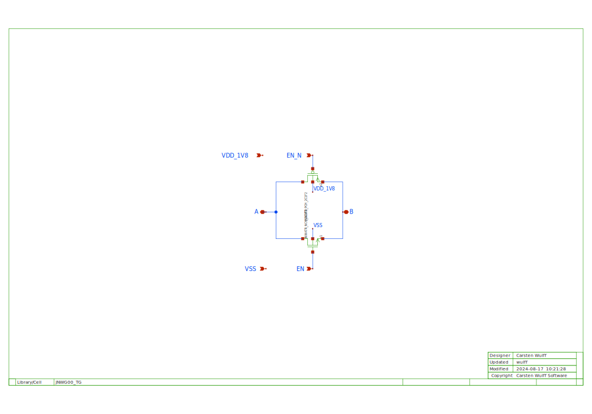
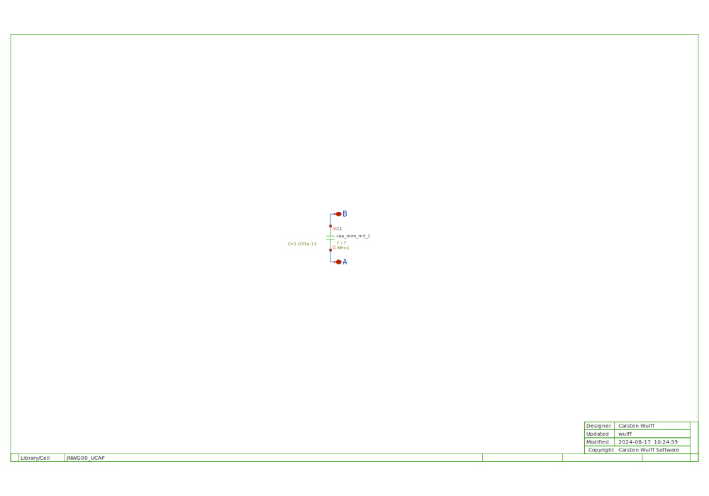
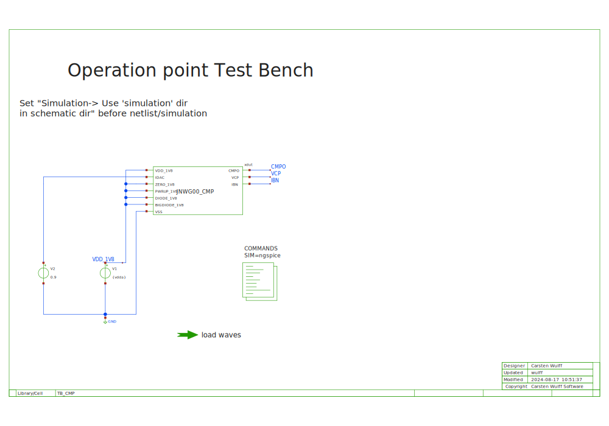

## JNW\_GR00\_SKY130NM/JNWG00\_BDAC

A bipolar DAC that can switch in

- Diode only (CTAT voltage)
- Big diode and resistor (PTAT current)
- Resistor to ground (CTAT current)

## JNW\_GR00\_SKY130NM/JNWG00\_CMP

## JNW\_GR00\_SKY130NM/JNWG00\_IDAC

The principle behind the IDAC is to have a single PMOS transistor, 
a DAC to control the gate voltage of the PMOS.

The PMOS gate is pre-charged to approximately 5 uA.

A SAR algorithm is run on the DAC to modify the PMOS gate voltage.

The IDAC must be powered down, and powered up once in a while.

## JNW\_GR00\_SKY130NM/JNWG00\_TG

## JNW\_GR00\_SKY130NM/JNWG00\_UCAP

## JNW\_GR00\_SKY130NM/TB\_CMP

