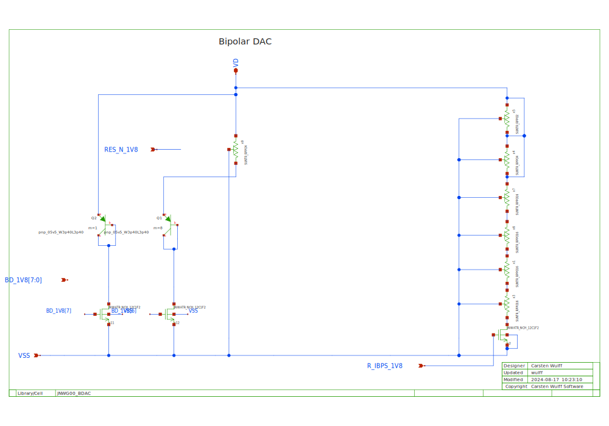
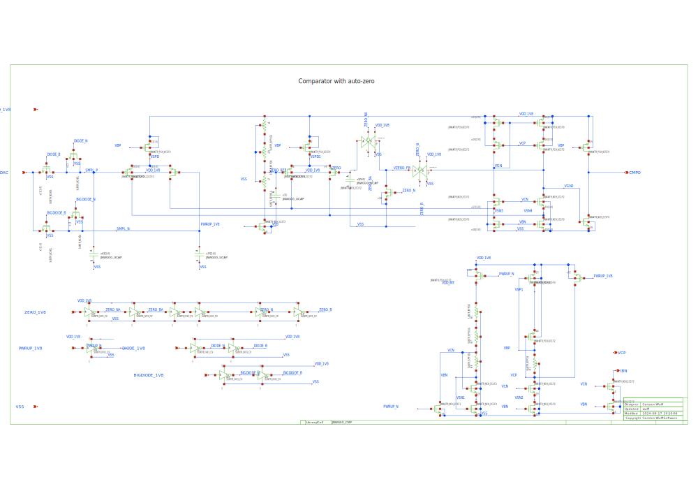
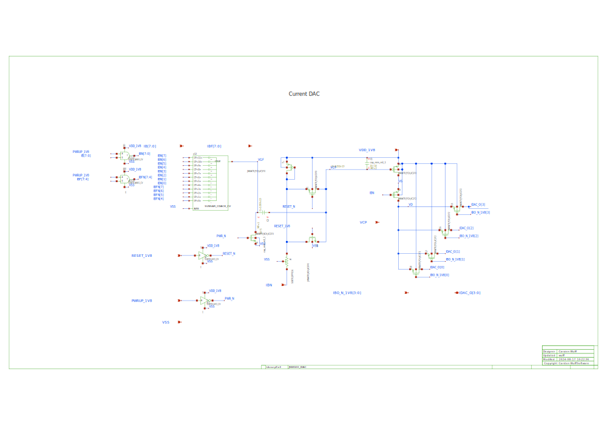

## JNW\_GR00\_SKY130NM/JNWG00\_ANA

## JNW\_GR00\_SKY130NM/JNWG00\_BDAC

A bipolar DAC that can switch in 1, or more (up to 8) diodes. 

There is also a resistor that can be enabled to provide R + diode combination.

## JNW\_GR00\_SKY130NM/JNWG00\_CCELL

The storage capacitor with a bottom plate sampling. The switched capacitor
includes the inverters to ensure the bottom plate is disconnected first.

## JNW\_GR00\_SKY130NM/JNWG00\_CMP

## JNW\_GR00\_SKY130NM/JNWG00\_CORE

## JNW\_GR00\_SKY130NM/JNWG00\_IDAC

The principle behind the IDAC is to have a single PMOS transistor, and use 
two segmented DACs to control the gate voltage of the PMOS.

At power off the gate of the PMOS is connected to ground, and the coarse DAC
bottom plates are connected to ground. As such, there is no charge stored in the
CDAC. 

A SAR algorithm is run on the coarse DAC first (`../verilog/core_tb.v`) and then on
the fine DAC. 

After the SAR algorithms the loop does a bang, bang type loop, increasing, or
decreasing the fine DAC. Hopefully that compensates for leakage in the IDAC. 

The IDAC must be powered down, and powered up once in a while.

## JNW\_GR00\_SKY130NM/JNW\_GR00

